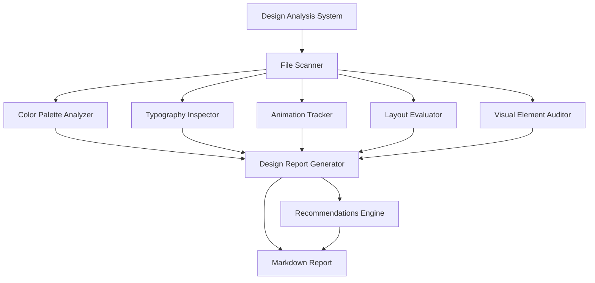

# Design Document

## Overview

The Portfolio Design Analysis System is a comprehensive tool that systematically examines and documents all design aspects of the portfolio website. The system analyzes the landing page (`app/page.tsx`) and about page (`app/about/page.tsx`) to extract design patterns, identify inconsistencies, and provide actionable recommendations for improvement.

The analysis covers six major areas:
1. Color scheme and accessibility
2. Typography and text hierarchy
3. Animations and interactions
4. Layout and spacing
5. Visual elements (images, icons, effects)
6. Design recommendations

The system will generate a detailed markdown report that serves as both documentation and a guide for design improvements.

## Architecture

### High-Level Architecture



### Component Flow

1. **File Scanner**: Reads all relevant files (TSX, CSS, config files)
2. **Analyzers**: Each analyzer processes specific design aspects
3. **Report Generator**: Compiles findings into structured documentation
4. **Recommendations Engine**: Generates actionable improvement suggestions

## Components and Interfaces

### 1. File Scanner

**Purpose**: Locate and read all files relevant to design analysis

**Input**:
- Root directory path
- File patterns to match (`.tsx`, `.css`, `.ts`)

**Output**:
- Array of file contents with metadata
- File dependency map

**Key Functions**:
```typescript
interface FileScanner {
  scanDirectory(path: string): Promise<FileNode[]>;
  readFileContent(filePath: string): Promise<string>;
  extractImports(content: string): string[];
}
```

### 2. Color Palette Analyzer

**Purpose**: Extract and analyze all colors used in the website

**Input**:
- CSS files (`globals.css`)
- Tailwind config (`tailwind.config.ts`)
- Component files with inline styles and Tailwind classes

**Output**:
```typescript
interface ColorAnalysis {
  lightMode: {
    primary: string[];
    secondary: string[];
    accent: string[];
    text: string[];
    background: string[];
  };
  darkMode: {
    primary: string[];
    secondary: string[];
    accent: string[];
    text: string[];
    background: string[];
  };
  gradients: GradientDefinition[];
  contrastRatios: ContrastCheck[];
  accessibilityIssues: AccessibilityIssue[];
}

interface ContrastCheck {
  foreground: string;
  background: string;
  ratio: number;
  wcagLevel: 'AAA' | 'AA' | 'Fail';
  location: string;
}
```

**Key Patterns to Extract**:
- CSS custom properties (`--background`, `--foreground`, etc.)
- Tailwind color classes (`text-gray-600`, `bg-blue-500`, etc.)
- Gradient definitions (`from-blue-500 via-purple-500 to-pink-500`)
- HSL color values from CSS variables

### 3. Typography Inspector

**Purpose**: Document all typography styles and text hierarchy

**Input**:
- Font definitions from `layout.tsx` (Geist Sans, Geist Mono)
- Tailwind config typography settings
- Component text styles

**Output**:
```typescript
interface TypographyAnalysis {
  fonts: {
    primary: FontDefinition;
    mono: FontDefinition;
  };
  textStyles: {
    h1: TextStyle;
    h2: TextStyle;
    h3: TextStyle;
    h4: TextStyle;
    body: TextStyle;
    small: TextStyle;
  };
  hierarchy: HierarchyCheck[];
  inconsistencies: TypographyIssue[];
}

interface TextStyle {
  fontSize: string[];
  fontWeight: string[];
  lineHeight: string[];
  letterSpacing?: string;
  color: string[];
  usage: string[]; // locations where used
}
```

**Key Patterns to Extract**:
- Font family declarations (`Geist`, `Geist_Mono`)
- Text size classes (`text-3xl`, `text-sm`, etc.)
- Font weight classes (`font-medium`, `font-semibold`, etc.)
- Line height and spacing

### 4. Animation Tracker

**Purpose**: Identify and document all animations and interactions

**Input**:
- Framer Motion components
- CSS transitions
- Hover effects

**Output**:
```typescript
interface AnimationAnalysis {
  framerMotionAnimations: MotionAnimation[];
  cssTransitions: CSSTransition[];
  hoverEffects: HoverEffect[];
  performanceMetrics: PerformanceCheck[];
  recommendations: AnimationRecommendation[];
}

interface MotionAnimation {
  component: string;
  type: 'initial' | 'animate' | 'whileHover' | 'whileInView';
  properties: {
    opacity?: number[];
    scale?: number[];
    x?: number[];
    y?: number[];
    rotate?: number[];
  };
  transition: {
    duration: number;
    ease: string;
    delay?: number;
  };
  location: string;
}
```

**Key Patterns to Extract**:
- `motion.div` components with animation props
- `initial`, `animate`, `whileHover`, `transition` properties
- CSS `transition` declarations
- Animation durations and easing functions

### 5. Layout Evaluator

**Purpose**: Analyze grid systems, spacing, and responsive design

**Input**:
- Container classes
- Grid/flex layouts
- Spacing utilities
- Responsive breakpoints

**Output**:
```typescript
interface LayoutAnalysis {
  containers: ContainerDefinition[];
  gridSystems: GridDefinition[];
  spacing: SpacingPattern[];
  breakpoints: ResponsiveBreakpoint[];
  inconsistencies: LayoutIssue[];
}

interface SpacingPattern {
  type: 'padding' | 'margin' | 'gap';
  values: string[];
  frequency: number;
  locations: string[];
}

interface ResponsiveBreakpoint {
  breakpoint: 'sm' | 'md' | 'lg' | 'xl';
  changes: ResponsiveChange[];
}
```

**Key Patterns to Extract**:
- Container max-widths (`max-w-5xl`, `max-w-7xl`)
- Padding/margin classes (`px-4`, `py-10`, `mt-10`)
- Grid definitions (`grid-cols-1`, `sm:grid-cols-2`)
- Responsive modifiers (`sm:`, `md:`, `lg:`)

### 6. Visual Element Auditor

**Purpose**: Catalog images, icons, and visual effects

**Input**:
- Image components
- Icon imports
- Shadow/border/gradient definitions

**Output**:
```typescript
interface VisualElementAnalysis {
  images: ImageDefinition[];
  icons: IconUsage[];
  effects: {
    shadows: ShadowDefinition[];
    borders: BorderDefinition[];
    gradients: GradientDefinition[];
    customEffects: CustomEffect[];
  };
  accessibility: AccessibilityCheck[];
}

interface ImageDefinition {
  src: string;
  alt: string;
  dimensions: { width: number; height: number };
  usage: string;
  optimization: 'good' | 'needs-improvement';
}
```

**Key Patterns to Extract**:
- `<Image>` components with src, alt, dimensions
- Icon imports from `@tabler/icons-react`
- Shadow classes (`shadow-xl`, `hover:shadow-2xl`)
- Border radius (`rounded-full`, `rounded-lg`)
- Custom effects (scrollbar styling, GridBackground, ClickSpark)

### 7. Design Report Generator

**Purpose**: Compile all analysis results into a structured markdown document

**Input**:
- Results from all analyzers
- Recommendations from each component

**Output**:
- Comprehensive markdown report with sections for each analysis area
- Code examples and visual references
- Prioritized recommendations

**Report Structure**:
```markdown
# Portfolio Design Analysis Report

## Executive Summary
- Key findings
- Critical issues
- Quick wins

## 1. Color Scheme Analysis
- Color palette (light/dark mode)
- Contrast ratios
- Accessibility issues
- Recommendations

## 2. Typography Analysis
- Font families
- Text hierarchy
- Consistency check
- Recommendations

## 3. Animation Analysis
- Animation inventory
- Performance assessment
- UX evaluation
- Recommendations

## 4. Layout Analysis
- Grid systems
- Spacing patterns
- Responsive design
- Recommendations

## 5. Visual Elements Analysis
- Image audit
- Icon usage
- Effects catalog
- Recommendations

## 6. Overall Recommendations
- Priority 1: Critical fixes
- Priority 2: Important improvements
- Priority 3: Nice-to-have enhancements
```

## Data Models

### Analysis Result Model

```typescript
interface AnalysisResult {
  metadata: {
    timestamp: string;
    version: string;
    pagesAnalyzed: string[];
  };
  colorAnalysis: ColorAnalysis;
  typographyAnalysis: TypographyAnalysis;
  animationAnalysis: AnimationAnalysis;
  layoutAnalysis: LayoutAnalysis;
  visualElementAnalysis: VisualElementAnalysis;
  recommendations: Recommendation[];
}

interface Recommendation {
  id: string;
  priority: 'critical' | 'high' | 'medium' | 'low';
  category: 'color' | 'typography' | 'animation' | 'layout' | 'visual';
  title: string;
  description: string;
  currentState: string;
  proposedSolution: string;
  codeExample?: string;
  impact: 'high' | 'medium' | 'low';
  effort: 'high' | 'medium' | 'low';
}
```

## Error Handling

### File Reading Errors
- **Issue**: File not found or inaccessible
- **Handling**: Log warning, continue with available files, note missing files in report

### Parsing Errors
- **Issue**: Invalid syntax or unexpected format
- **Handling**: Catch parsing errors, log details, skip problematic section, continue analysis

### Analysis Errors
- **Issue**: Unexpected data structure or missing properties
- **Handling**: Use default values, log warnings, mark section as "needs manual review"

### Report Generation Errors
- **Issue**: Unable to write output file
- **Handling**: Retry with alternative path, output to console if file write fails

## Testing Strategy

### Unit Tests
1. **Color Extraction Tests**
   - Test CSS variable parsing
   - Test Tailwind class extraction
   - Test gradient pattern matching
   - Test contrast ratio calculations

2. **Typography Parsing Tests**
   - Test font family extraction
   - Test text size classification
   - Test hierarchy detection

3. **Animation Detection Tests**
   - Test Framer Motion prop extraction
   - Test CSS transition parsing
   - Test animation property identification

4. **Layout Pattern Tests**
   - Test spacing value extraction
   - Test responsive breakpoint detection
   - Test grid system identification

### Integration Tests
1. **End-to-End Analysis**
   - Run full analysis on sample portfolio
   - Verify all sections are populated
   - Check report format and structure

2. **Multi-Page Analysis**
   - Test analysis across landing and about pages
   - Verify consistency checking between pages
   - Validate cross-page recommendations

### Manual Testing
1. **Report Quality Review**
   - Verify accuracy of extracted design elements
   - Check usefulness of recommendations
   - Validate code examples

2. **Edge Cases**
   - Test with missing files
   - Test with malformed CSS
   - Test with unusual component structures

## Implementation Notes

### Technology Stack
- **Language**: TypeScript
- **File System**: Node.js `fs` module
- **Parsing**: Regular expressions, AST parsing for complex cases
- **Report Generation**: Template strings, markdown formatting

### Key Libraries
- `@babel/parser`: For parsing JSX/TSX files
- `postcss`: For parsing CSS
- `chalk`: For colored console output during analysis
- `gray-matter`: For potential frontmatter in markdown output

### Performance Considerations
- Cache file contents to avoid repeated reads
- Use streaming for large files
- Parallelize independent analyzers
- Limit regex complexity for performance

### Extensibility
- Plugin architecture for adding new analyzers
- Configurable analysis rules
- Custom report templates
- Export formats (JSON, HTML, PDF)
